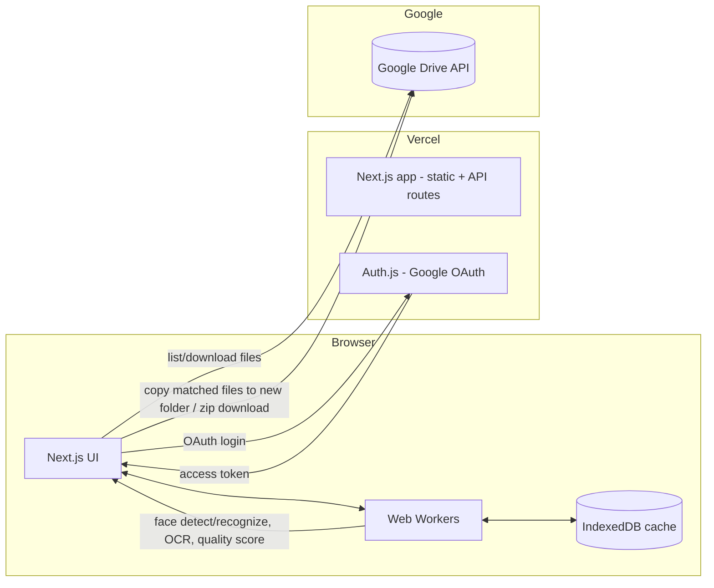

# Frame Me — Product & Tech Plan

## 1. Problem statement

People attend events (races, cycling events, meetups, weddings, parties) where a
photographer/organizer shares **one big Google Drive folder** with hundreds or
thousands of photos. Finding "my" photos means manually scrolling through
everything.

- **Use case 1 (MVP):** Given a shared Google Drive folder link, let a user
  find only *their* photos — by face (selfie match) and/or bib number (for
  races) — and export/download just those.
- **Use case 2 (Phase 2):** Given a huge dump of wedding photos, help the
  couple/editor narrow thousands of shots down to the best 100–200 for an
  album (sharpness, exposure, duplicates, expressions, people coverage).

## 2. Guiding constraint: $0 hosting cost on Vercel

Vercel's free **Hobby** tier gives generous static hosting + a small amount of
serverless/edge function execution, but it is **not** meant for long-running,
CPU-heavy jobs (face recognition models, OCR, image processing over thousands
of files). Two options exist:

1. Run heavy compute server-side → needs a GPU/CPU worker → costs money.
2. **Run heavy compute in the user's browser** (WebAssembly / TensorFlow.js /
   WebGPU) → zero marginal compute cost, scales with the number of users for
   free, and as a bonus keeps private photos off our servers entirely.

We choose **(2): a client-heavy, "local-first" architecture.** The Next.js app
on Vercel is mostly a thin shell: auth, UI, and orchestration. All face
recognition, OCR, and photo-scoring happens in the browser using Web Workers,
with results cached in IndexedDB.

## 3. High-level architecture



Key point: photos never pass through our server. The browser talks directly
to the Google Drive API using the user's own OAuth token, downloads images,
processes them locally, and either (a) copies matches into a new Drive folder
via the Drive API, or (b) zips them client-side for download.

## 4. Tech stack

| Layer | Choice | Why |
|---|---|---|
| Framework | **Next.js 15 (App Router) + TypeScript** | Free Vercel-native hosting, SSR for landing/marketing pages, API routes only where needed |
| UI | **Tailwind CSS + shadcn/ui** | Free, fast to build, accessible components |
| Auth | **Auth.js (NextAuth) — Google provider** | Handles OAuth + Drive scopes, session cookies, free |
| Photo source | **Google Drive REST API v3** (called directly from the browser with the user's access token) | No storage cost for us, works with "someone shared a folder with me" flow |
| Face detection & recognition | **face-api.js** (TensorFlow.js, WASM/WebGL backend) | Runs fully client-side, gives 128-d face descriptors for similarity matching, no server cost |
| Bib number OCR | **Tesseract.js** | Pure client-side OCR (WASM), free, good enough for printed bib numbers |
| Photo quality scoring (Phase 2) | Custom JS: Laplacian-variance blur score, exposure histogram, face-api.js expression/eye-open detection, perceptual hash (pHash) for near-duplicate detection | All doable with canvas + small JS libs, no ML hosting needed |
| Background processing | **Web Workers** (via `comlink`) | Keeps UI responsive while processing hundreds of images |
| Client caching/state | **IndexedDB** (`idb-keyval`) + **Zustand** + **TanStack Query** | Avoid recomputation on refresh/resume, cache Drive listings |
| Export | **Drive API `files.copy`** (create a "Filtered" folder in user's own Drive) or **JSZip** for direct ZIP download | Zero-storage export options |
| Hosting | **Vercel Hobby (free)** | Static assets + light API routes only |
| Analytics/errors (optional) | **Vercel Analytics** + **Sentry free tier** | Free tiers sufficient at low scale |
| Optional DB (only if cross-device history needed later) | **Supabase free tier (Postgres)** | Not required for MVP; everything can be session/browser local |

Total baseline cost: **$0/month**, only Google Drive API usage (free quota is
very generous — no billing required for read/list/copy operations at this
scale).

## 5. Use case 1 flow (MVP): filter by face / bib number

1. User signs in with Google (`Auth.js`), granting `drive.readonly` (to read
   the shared folder) and `drive.file` (to create a results folder) scopes.
2. User pastes the shared Google Drive folder link.
3. App **recursively walks the folder tree**: `files.list` with
   `q="'<folderId>' in parents and trashed=false"`, queued breadth-first —
   any result with `mimeType='application/vnd.google-apps.folder'` is pushed
   back onto the queue as a new folder to scan, and paginated with
   `pageToken` until exhausted. Image files (`mimeType` starting with
   `image/`) found at any depth are added to the working set, tagged with
   their subfolder path (useful context for organizers who split photos into
   per-session/per-category subfolders).
4. User provides identity info:
   - Uploads/takes a **selfie**, and/or
   - Types their **bib number**.
5. A Web Worker pool:
   - Downloads each photo (as a blob) from Drive.
   - Runs `face-api.js` to detect faces + compute descriptors, compares
     against the selfie descriptor (Euclidean distance threshold).
   - Runs `Tesseract.js` OCR over the frame (or a cropped bib region) and
     regex-matches the bib number.
   - Caches per-file result (`fileId -> {match, score}`) in IndexedDB so a
     resumed/re-run session doesn't reprocess unchanged files.
6. UI shows matched photos in a grid with confidence scores; user can
   deselect false positives.
7. Export: "Copy to my Drive" (creates `Frame Me - Filtered` folder, uses
   `files.copy`) or "Download ZIP" (fetches blobs, zips with `JSZip`).

## 6. Use case 2 flow (Phase 2): best-of album picker

1. Same Drive ingestion as above, but for the couple's *own* full photo dump.
2. Per-photo local scoring pipeline (Web Worker):
   - **Sharpness**: Laplacian variance over grayscale canvas data.
   - **Exposure**: histogram check for under/over-exposure.
   - **Faces**: presence, eyes-open, smiling (via `face-api.js` expressions).
   - **Duplicates/bursts**: perceptual hash (pHash) clustering — pick the
     sharpest/best-expression photo per near-duplicate cluster.
   - **People coverage**: cluster face descriptors across the set to avoid
     the album being 90% the same two people; encourage inclusion of guests.
3. Combine into a single composite score; rank all photos.
4. User reviews top N (adjustable target count, e.g. 150), can swap
   photos in/out.
5. Same export options as use case 1.

## 7. Why not do it server-side?

| Approach | Cost | Notes |
|---|---|---|
| Vercel serverless functions running face recognition | Free tier has ~10–60s execution limits and no persistent GPU/CPU for ML models; would need external inference (Replicate/HF/AWS Rekognition) which **costs money per call** | Rejected for MVP |
| Dedicated backend worker (Fly.io/Render/Railway) | Free tiers exist but are limited (often sleep, small CPU) and add operational complexity | Possible future upgrade, not needed for MVP |
| **Client-side (chosen)** | **$0**, scales automatically with users, keeps user photos private (never uploaded to us) | Trade-off: slower on low-end devices, fully depends on browser capability |

## 8. Google OAuth / Drive API notes (important gotchas)

- `drive.readonly` is a **sensitive scope**. In Google Cloud Console, while
  the OAuth consent screen is in **"Testing"** status you can add up to 100
  test users without formal verification — fine for a personal MVP or beta.
  Going to production with many external users requires Google's app
  verification process.
- `drive.file` (create/access only files the app itself creates, e.g. the
  export folder) is **not** a sensitive scope and needs no verification —
  use this instead of broader scopes wherever possible.
- Drive API has a free daily quota (per-user and per-project rate limits)
  that comfortably covers listing/downloading/copying files for this use
  case at low-to-moderate scale.
- The user must have access to the shared folder already (Drive's own
  sharing/permissions handle that) — our app never needs elevated access to
  someone else's Drive.
- Recursive subfolder traversal means one `files.list` call per folder
  discovered — for deeply nested trees this can add up quickly. Mitigate
  with: concurrency capping (a handful of parallel `files.list` calls at a
  time, not one per folder at once), an IndexedDB cache keyed by folder ID
  so a re-visit/resume doesn't re-walk unchanged folders, and a UI progress
  indicator ("scanned 12 subfolders, found 340 photos so far") since the
  walk can take a few seconds on large albums.

## 9. Suggested repo structure

```
frame-me/
  docs/
    plan.md               <- this file
  src/
    app/                  <- Next.js App Router pages & API routes
      api/auth/[...nextauth]/
    components/            <- UI components (shadcn/ui based)
    lib/
      drive/               <- Drive API client helpers
      workers/             <- Web Worker entry points
        face-worker.ts
        ocr-worker.ts
        quality-worker.ts
      scoring/             <- blur/exposure/phash/composite scoring logic
    stores/                 <- Zustand stores
  public/
    models/                <- face-api.js model weights (self-hosted, cached)
```

## 10. Phased roadmap

- **Phase 0 — Setup:** Next.js + Vercel deploy, Google Cloud project + OAuth
  consent screen (testing mode), Auth.js Google login working end-to-end.
- **Phase 1 — MVP (Use case 1):**
  - Drive folder link → list photos.
  - Selfie upload → face matching.
  - Bib number → OCR matching.
  - Review grid + export (ZIP / copy-to-Drive).
- **Phase 2 — Best-of album picker (Use case 2):**
  - Quality scoring pipeline (blur, exposure, expressions, duplicates).
  - People-coverage-aware ranking.
  - Adjustable "pick top N" review UI.
- **Phase 3 (future, optional):**
  - Cross-device saved sessions (Supabase free tier).
  - Smarter bib detection (small on-device object detector to crop bib
    region before OCR, improving accuracy).
  - Shareable results link for non-technical users.

## 11. Cost summary

| Item | Cost |
|---|---|
| Vercel Hobby hosting | $0 |
| Google Drive API usage | $0 (within free quota) |
| face-api.js / Tesseract.js / pHash | $0 (open source, self-hosted static assets) |
| Auth.js | $0 |
| Analytics/error tracking (optional) | $0 (free tiers) |
| **Total** | **$0/month** |

Costs only enter the picture if usage scales far beyond personal/small-group
use (e.g., needing Google app verification support, or moving heavy
processing server-side for very large events) — not a concern for MVP.
